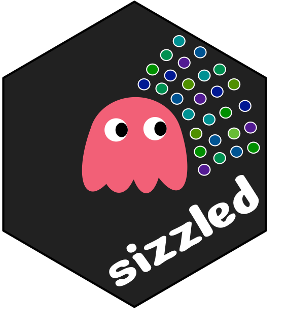

<!-- README.md is generated from README.Rmd. Please edit that file -->

# sizzled 

<!-- badges: start -->

[](https://www.tidyverse.org/lifecycle/#experimental)
<!-- badges: end -->

The aim of sizzled package is to use some foundational aspects of
edibble package but include extra functionality to support experiments
that initially have an unknown structure, i.e. requiring calculation for
sample size for some units.

(WIP) There is not much to see here.

Below is not implemented.

``` r
library(edibble)
library(sizzled)
out <- start_design() %>% 
  set_trts(treat = c("placebo", "vaccine")) %>% 
  set_units(person = symbol("npeople")) %>% 
  allocate_trts(treat ~ person) %>% 
  randomise_trts() %>% 
  serve_table()

# trying different sample sizes, 
# output here is a list
out %>% 
  set_symbols(npeople = c(40, 100, 200))

# standard sample size calculator
# non-vectorised version
out %>% 
  set_symbols(npeople = siz(power = 80,
                            sig_level = 0.05,
                            alternative = "two.sided",
                            effect = 3,
                            target_group = treat))

# vectorised version
out %>% 
  set_symbols(npeople = sizz(...))

# proportion version
out %>% 
  set_symbols(npeople = sizp(...))

# one that relies on other unit structures, etc
out %>% 
  set_symbols(npeople = sizzz(...))

# add more z to have other variations, but more z usually means more
# complex structure
```

One shouldn’t sizzle too much lest you overcook your edibble design.

The sizzling sound also could be the sound of the statistician silently
boiling in anger when told to do yet another sample size calculation
from their non-statistical colleague. Beware of that sizzling
statistician.

See this [video](https://www.youtube.com/watch?v=Hz1fyhVOjr4&ab_channel=RunProgramRun) about the sizzling statistician 😂
